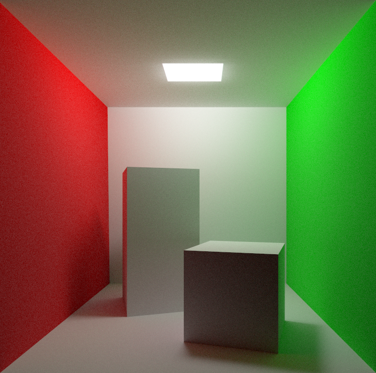

# renderer

Path traced renderer in WebGPU and Rust

## Features

- Multiple light bounces
- Diffuse materials with Lambert scattering
- Built-in antialising (no post-processing)
- .obj scene files for geometry
- .mtl materials with diffuse and ambient colors
- PCG random white noise
- All rendering logic in WGSL compute shaders

## Running

`cargo run`
